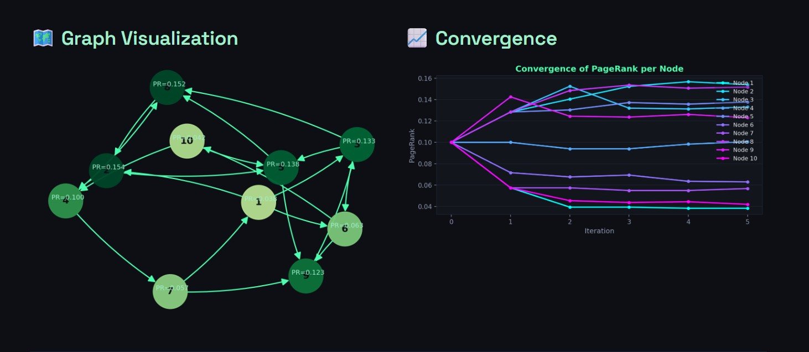
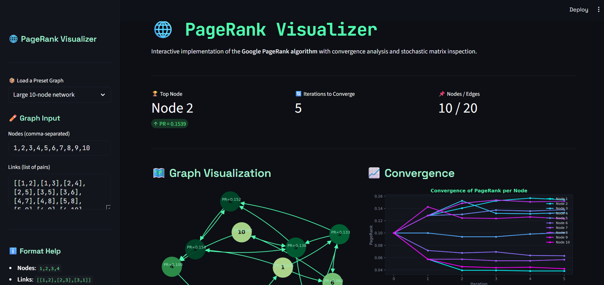
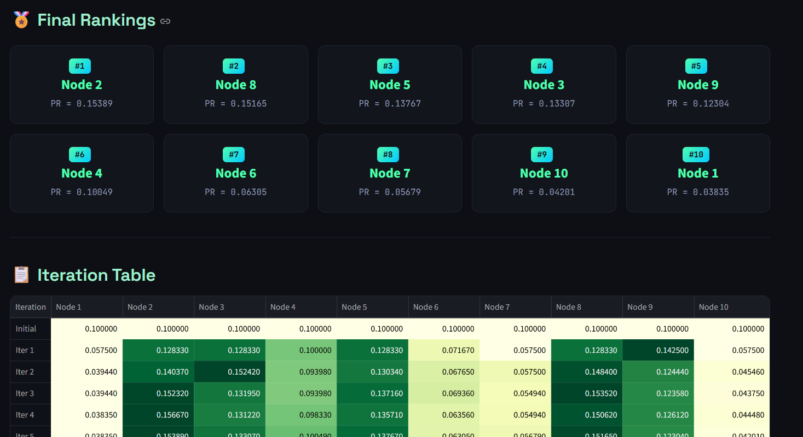
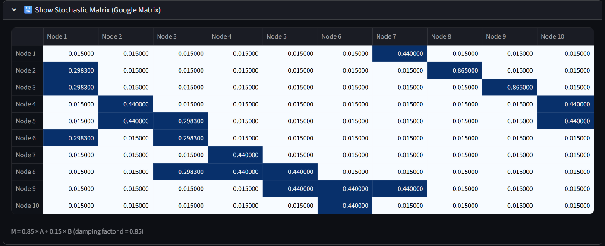

# PageRank Visualizer 🌐📊

A Python implementation of the **Google PageRank algorithm** with an interactive GUI for graph input, iterative rank computation, convergence visualization, and stochastic matrix inspection.

<div align="center">
  
</div>

## 📋 Description

This project implements the PageRank algorithm from scratch, faithfully replicating the iterative power method used by Google to rank web pages. Given a directed graph of nodes and links, the tool computes PageRank scores until convergence, handles dangling nodes (pages with no outbound links), and presents results through a clean GUI with graph visualization and an iteration-by-iteration breakdown table.

<br>
<div align="center">
  <a href="https://YOUR-STREAMLIT-APP-LINK.streamlit.app/">
    
  </a>
</div>
<br>
<div align="center">
  <a href="https://codeload.github.com/TendoPain18/pagerank-visualizer/legacy.zip/main">
    
  </a>
</div>

## 🎯 Project Objectives

1. **Implement PageRank from scratch** using the iterative power method
2. **Handle dangling nodes** by redistributing their rank uniformly
3. **Visualize the graph** with node colors scaled by PageRank score
4. **Show convergence** through an iteration-by-iteration breakdown table
5. **Inspect the Google Matrix** (stochastic matrix) used internally

## ✨ Features

- **Iterative PageRank Computation**: Runs until convergence (Δ < 0.005 per node)
- **Dangling Node Handling**: Nodes with no outbound links redistribute rank equally to all nodes
- **Graph Visualization**: Directed graph drawn with NetworkX and Matplotlib
- **Iteration Table**: Full breakdown of PageRank values per node per iteration, with final ranking row
- **Stochastic Matrix Inspector**: View the Google Matrix `M = 0.85A + 0.15B` used in computation
- **Interactive Streamlit App**: Web-based simulator with presets, convergence plot, and matrix view

## 🔬 Algorithm Overview

**PageRank Formula:**
```
PR(u) = (1 - d) / N  +  d × Σ [ PR(v) / L(v) ]
```

Where:
- `d = 0.85` — damping factor (probability of following a link)
- `N` — total number of nodes
- `L(v)` — number of outbound links from node v
- The sum is over all nodes v that link to u

**Dangling Node Adjustment:**
Nodes with no outbound links are treated as linking to every node in the graph with equal probability `1/N`.

**Convergence:**
Iterations stop when the absolute difference between consecutive PageRank vectors is less than 0.005 for all nodes.

**Google Matrix:**
```
M = d × A + (1 - d) × B
```
Where A is the column-stochastic adjacency matrix and B is the uniform teleportation matrix.

## 📊 Screenshots

### Main GUI Window


### Iteration Table & Graph


### Stochastic Matrix View


## 🚀 Getting Started

### Prerequisites

```
Python 3.7+
tkinter (comes with Python)
networkx
matplotlib
pandas
numpy
```

### Installation

1. **Clone the repository**
```bash
git clone https://github.com/TendoPain18/pagerank-visualizer.git
cd pagerank-visualizer
```

2. **Install dependencies**
```bash
pip install -r requirements.txt
```

3. **Run the application**
```bash
python main.py
```

## 📖 Usage

1. Enter a comma-separated list of node IDs in the **Nodes List** field
2. Enter the directed links as a list of pairs in the **Links List** field
3. Click **Calculate** to compute PageRank and visualize the graph
4. Click **Show Multiplication Process** to inspect the stochastic matrix and per-iteration matrix multiplications

**Example Input:**
```
Nodes: 1,2,3,4,5,6,7,8,9,10
Links: [[1,2],[1,3],[2,4],[2,5],[3,5],[3,6],[4,7],[4,8],[5,8],[5,9],[6,9],[6,10],[7,1],[8,2],[9,3],[10,4],[1,6],[7,9],[10,5],[3,8]]
```

## 🌐 Interactive Simulator

An interactive web version is available via Streamlit with additional features:

- **Preset graphs** to get started instantly
- **Convergence plot** showing PageRank evolution per node across iterations
- **Color-coded graph** where node color intensity reflects PageRank score
- **Ranked leaderboard** of nodes by final PageRank
- **Full iteration table** and stochastic matrix viewer

[](https://YOUR-STREAMLIT-APP-LINK.streamlit.app/)

## 📦 Requirements

See `requirements.txt` for the full list. Key dependencies:

- `networkx` — graph construction and layout
- `matplotlib` — graph and table rendering
- `pandas` — iteration table display
- `numpy` — stochastic matrix computation
- `streamlit` — web-based interactive simulator

## 🤝 Contributing

Feel free to open issues or pull requests for improvements such as additional layout algorithms, animated convergence, or export features.

## 🙏 Acknowledgments

- PageRank algorithm: Brin & Page, "The Anatomy of a Large-Scale Hypertextual Web Search Engine" (1998)
- NetworkX for graph algorithms and layout

<br>
<div align="center">
  <a href="https://codeload.github.com/TendoPain18/pagerank-visualizer/legacy.zip/main">
    
  </a>
</div>

## <!-- CONTACT -->
<!-- END CONTACT -->

## **Rank the web, one iteration at a time! 🌐✨**
